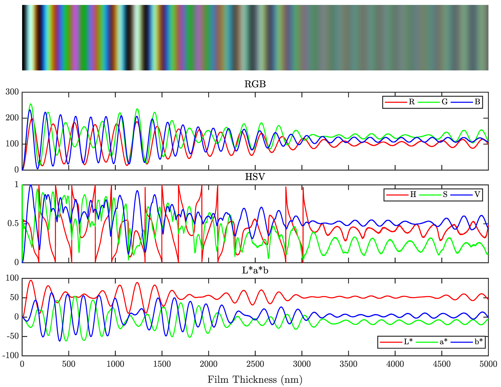

# ColorMapGenerator
Matlab codes for generating color maps for analyzing thin film interference patterns. The primary script 'generateColorMap.m' generates the relavent color map, while the associated test script visualizes the computed colormap. An example is shown below:

Fig: Visualization of the color map in 3 three different color spaces for a refractive index triplet of (1 1.4 1) and RGB camera gains of (2.03,1.5,1).  
